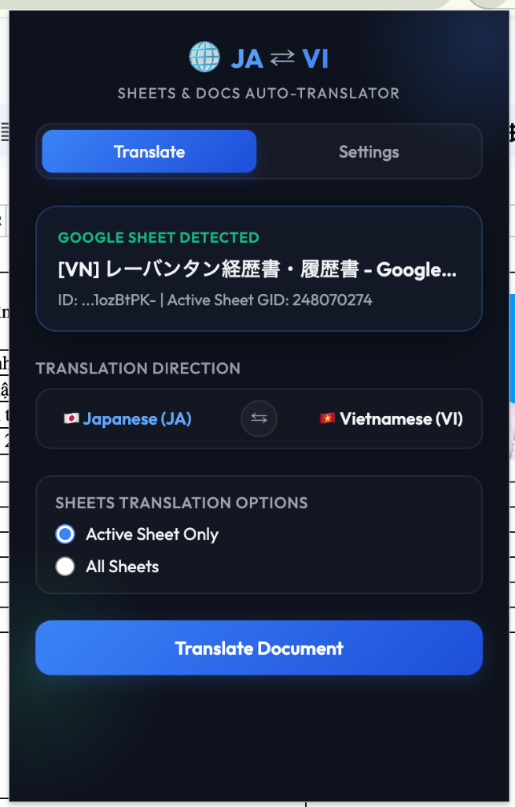
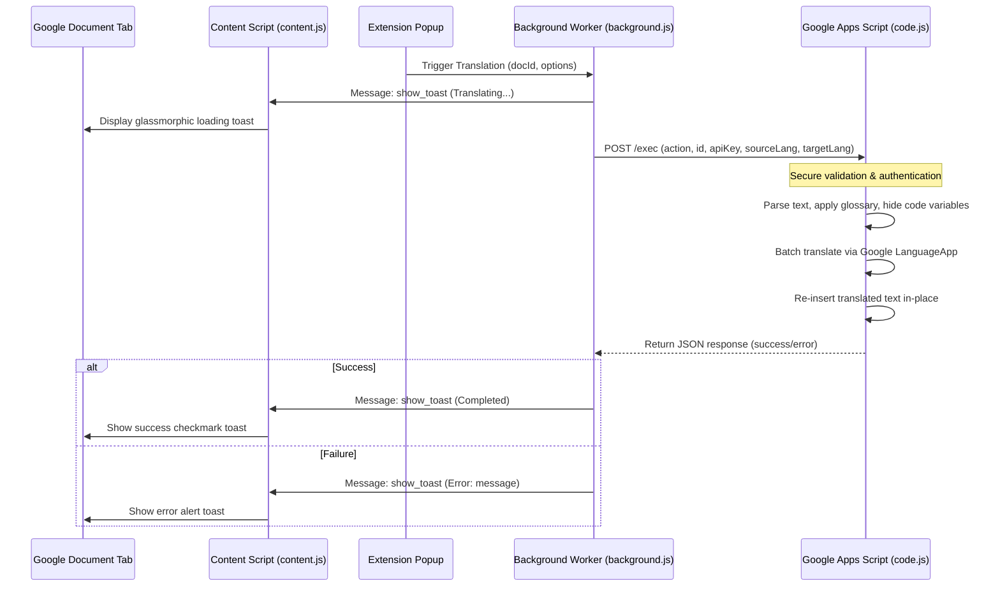

# JA-VI Sheets & Docs Translator

An open-source Google Chrome Extension and companion Google Apps Script that auto-translates Google Sheets, Google Docs, and Google Slides in-place between Japanese and Vietnamese. It features smart technical keyword protection, glossary support, and premium glassmorphic toast alerts.

---

## Language Select / Chọn Ngôn Ngữ / 言語選択
* **English:** [English Version (This file)](#overview)
* **Tiếng Việt:** [Tiếng Việt (Vietnamese Version)](README_vi.md)
* **日本語:** [日本語版 (Japanese Version)](README_ja.md)

---

## Overview

Translating Google Workspace documents (Sheets, Docs, Slides) using traditional browser extensions is slow and fragile due to Google's complex HTML Canvas rendering (especially in Sheets) and heavy DOM structure. 

**JA-VI Sheets & Docs Translator** solves this by using a hybrid architecture:
1. **Chrome Extension Front-End:** Detects the active document ID and configurations, sending translation commands.
2. **Google Apps Script Back-End:** Runs securely within your own Google account, using official Google APIs to translate and write back content in-place with maximum speed and reliability.

  

---

## Why this project? / Motivation

As a Bridge System Engineer (BrSE) and Project Manager (PjM) working in cross-border software development (particularly Japan-Vietnam outsourcing), one of the biggest bottlenecks is communication. Spec documents, API contracts, database schemas, and project requirements are constantly written in Google Sheets, Docs, or Slides. 

Manually copying and pasting these technical texts into Google Translate or DeepL is slow, tedious, and often destroys code variable names, formatting, or dropdown lists.

This tool was born to **bridge the gap** instantly:
- **For BrSEs & PjMs:** Save hours of manual translation work and update entire requirement files in-place with a single click.
- **For Developers:** Access translated specifications immediately without losing technical keyword formatting (variables, casing, numbers), ensuring precise implementation without communication overhead.

---

## Features

- **Bi-Directional Translation:** Easily switch between Japanese to Vietnamese (`JA ➔ VI`) and Vietnamese to Japanese (`VI ➔ JA`).
- **Auto Ownership Detection & 1-Click Copy:** Automatically detects if a document (Doc, Sheet, Slide) is owned by a different Google account and displays a prominent "Make a Copy to My Drive" button both in the Extension Popup and directly as an in-page floating widget.
- **Google Sheets Options:** Translate only the active sheet tab or all sheet tabs in the entire workbook.
- **Data Validation & Dropdowns:** Automatically updates `VALUE_IN_LIST` data validation dropdown ranges so your forms remain fully translated and operational.
- **Technical Keyword Protection:** Automatically detects and protects code variables, camelCase, PascalCase, kebab-case, snake_case, and numbers from being translated.
- **Custom Glossary Support:** Define custom overrides (e.g., `ひたち = HITACHI`) on the fly.
- **Premium Glassmorphic Notifications:** High-performance, modern in-page status toasts overlayed on Google Documents to track progress without breaking your flow.
- **100% Free & Secure:** Runs entirely on your own Google account using free Google translation quotas. No external third-party servers see your data.

---

## Installation & Setup Guide

### Step 1: Deploy the Google Apps Script
1. Go to [Google Apps Script Dashboard](https://script.google.com/) and click **New Project**.
2. Copy the code from [apps-script/code.js](apps-script/code.js) and paste it into the editor, replacing all default code.
3. Save the project (e.g., name it `JA-VI Sheets & Docs Translator Backend`).
4. **Authorize the script (Highly Recommended):** 
   - Select the `authorizeScript` function in the toolbar dropdown.
   - Click **Run**.
   - Google will show an "Authorization Required" popup. Review permissions and grant access (click *Advanced* -> *Go to [Project Name] (unsafe)* to authorize).
5. **Deploy as Web App:**
   - Click **Deploy ➔ New deployment**.
   - Click the gear icon (Select type) and choose **Web app**.
   - Under **Execute as**, select **Me (your-email@gmail.com)**.
   - Under **Who has access**, select **Anyone** (this is required for the Extension to talk to your Web App, but access is locked by your custom security token).
   - Click **Deploy**.
   - Copy the generated **Web App URL** (which ends in `/exec`).

### Step 2: Install the Chrome Extension
1. Clone or download this repository to your local machine.
2. Open Google Chrome and go to `chrome://extensions/`.
3. Enable **Developer mode** (toggle in the top-right corner).
4. Click **Load unpacked** (top-left button).
5. Select the root folder of this repository (the directory containing [manifest.json](manifest.json)).

### Step 3: Configure Settings
1. Click the **JA-VI Sheets & Docs Translator** extension icon in your Chrome toolbar.
2. Switch to the **Settings** tab.
3. Paste the **Apps Script Web App URL** you copied in Step 1.
4. Input a custom **Security Token (API Key)**. This is a secure passphrase of your choice.
5. (Optional) Under **Custom Glossary**, enter custom word overrides, one per line, using the format `Word = Translation` (e.g., `ひたち = HITACHI`).
6. Click **Save Settings**.
7. Click **Verify Connection**. 
   - *Note: On the first connection, the extension registers your chosen Security Token in the Apps Script. Subsequent requests are locked and will only succeed if the token matches.*

---

## How to Use
1. Open any Google Sheet, Google Doc, or Google Slide containing Japanese or Vietnamese text.
2. Click the extension icon to open the popup.
3. Select the translation direction (e.g., `Japanese (JA)` to `Vietnamese (VI)`).
4. (For Sheets) Choose whether to translate the **Active Sheet Only** or **All Sheets**.
5. Click **Translate Document**.
6. A toast notification will appear in the bottom-right corner of your Google Document displaying the translation status.

---

## Privacy & Security

- **No Third-Party Tracking:** All document processing and translations occur directly within your browser and Google account using Google's translation service. No data is sent to external platforms.
- **Secure Endpoints:** The security token acts as a custom passphrase to authenticate the Chrome extension with the Apps Script Web App. Without the token, the Web App will reject all commands.

---

## License

This project is distributed under the **MIT License**. See the `LICENSE` file for details (or feel free to use and distribute it freely for personal/commercial use).
