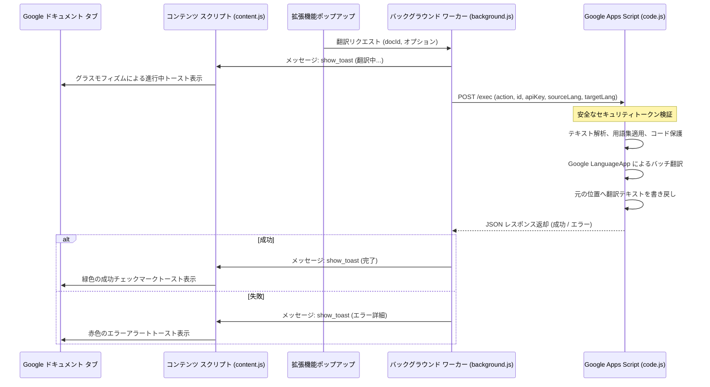

# JA-VI Sheets & Docs Translator (日本語版)

Google Chrome 拡張機能と Google Apps Script (GAS) を組み合わせ、Google スプレッドシート、ドキュメント、スライドを日本語とベトナム語の間で相互にインプレース（元の位置のまま）翻訳するオープンソースツールです。コード変数や camelCase などの技術キーワードの保護、カスタム用語集（グロッサリー）機能、および洗練されたグラスモフィズムの通知トーストを備えています。

---

## 他の言語ドキュメント / Other Languages
* [English Version (Main README)](README.md)
* [Tiếng Việt (Vietnamese Version)](README_vi.md)

---

## 概要

従来のブラウザ拡張機能で Google Workspace ドキュメント（スプレッドシート、ドキュメント、スライド）を翻訳する場合、Google の複雑な HTML Canvas レンダリング（特にスプレッドシート）や複雑な DOM 構造のため、動作が遅く、失敗しやすいという課題がありました。

**JA-VI Sheets & Docs Translator** は、以下のハイブリッドアーキテクチャによりこの問題を解決します。
1. **Chrome 拡張機能（フロントエンド）:** アクティブなドキュメント ID と設定を検出し、翻訳コマンドを送信します。
2. **Google Apps Script（バックエンド）:** ユーザー自身の Google アカウント内で安全に動作し、Google 公式 API を使用して、インプレース（元の位置のまま）で高速かつ安定した書き換えを実行します。

---

## 主な機能

- **双方向翻訳:** 日本語からベトナム語（`JA ➔ VI`）およびベトナム語から日本語（`VI ➔ JA`）の翻訳を簡単に切り替え可能。
- **Google スプレッドシート翻訳オプション:** アクティブなシートのみ、またはワークブック内のすべてのシートを一括翻訳可能。
- **データの入力規則（プルダウン）の更新:** 「リストから選択」ルール内の選択肢テキストも自動的に翻訳して更新するため、フォームが翻訳後も正常に機能します。
- **技術キーワード保護機能:** コード内の変数、camelCase、PascalCase、kebab-case、snake_case、数値などを自動的に検出し、翻訳エンジンによる意図しない誤訳や破損から保護します。
- **カスタム用語集（グロッサリー）対応:** ポップアップ画面からその場でカスタムの翻訳ルールを指定可能（例: `ひたち = HITACHI`）。
- **洗練されたグラスモフィズム通知:** Google ドキュメントの画面上にオーバーレイ表示される洗練された進行状況通知トーストにより、作業を中断せずに進捗状況を確認できます。
- **100% 無料かつ安全:** サードパーティの外部サーバーを介さず、ユーザー自身の Google アカウントの無料の翻訳枠（LanguageApp）で動作するため、機密情報などのデータ流出の心配がありません。

---

## セットアップ手順

### ステップ 1: Google Apps Script (GAS) のデプロイ
1. [Google Apps Script ダッシュボード](https://script.google.com/) にアクセスし、**「新しいプロジェクト」**を作成します。
2. [apps-script/code.js](apps-script/code.js) のコードをすべてコピーし、エディタに貼り付けて上書き保存します。
3. プロジェクト名（例: `JA-VI Translator Backend`）を付けて保存します。
4. **スクリプトの認証（強く推奨）:** 
   - ツールバーの関数リストから `authorizeScript` を選択します。
   - **「実行」**をクリックします。
   - Google の承認要求ポップアップが表示されるので、画面の指示に従ってアクセスを承認します（「詳細を表示」 ➔ 「[プロジェクト名] (安全ではないページ) に移動」をクリックして進みます）。
5. **ウェブアプリとしてデプロイ:**
   - **「デプロイ ➔ 新しいデプロイ」**をクリックします。
   - 種類の選択（歯車アイコン）から**「ウェブアプリ」**を選択します。
   - **次のユーザーとして実行:** **「自分」**を選択します。
   - **アクセスできるユーザー:** **「全員」**を選択します（拡張機能からアクセスできるようにするためですが、セキュリティトークンで保護されます）。
   - **「デプロイ」**をクリックします。
   - 生成された**「ウェブアプリの URL」**（末尾が `/exec` のもの）をコピーします。

### ステップ 2: Chrome 拡張機能のインストール
1. このリポジトリをご自身のローカルPCにダウンロードまたはクローンします。
2. Google Chrome を開き、`chrome://extensions/` にアクセスします。
3. 右上の**「デベロッパー モード」**をオンにします。
4. 左上の**「パッケージ化されていない拡張機能を読み込む」**をクリックします。
5. このリポジトリのルートフォルダ（[manifest.json](manifest.json) が含まれるディレクトリ）を選択して読み込みます。

### ステップ 3: 接続設定
1. Chrome ツールバーの **JA-VI Sheets & Docs Translator** 拡張機能アイコンをクリックしてポップアップを開きます。
2. **「Settings」**タブに切り替えます。
3. ステップ 1 でコピーした **Apps Script ウェブアプリの URL** を貼り付けます。
4. 任意の**セキュリティトークン (Security Token / API Key)** を入力します（任意の安全なパスフレーズ）。
5. （任意）特定の単語の翻訳を指定したい場合は、**Custom Glossary** に `元の単語 = 翻訳後の単語` の形式で1行ずつ入力します（例: `ひたち = HITACHI`）。
6. **「Save Settings」** をクリックして設定を保存します。
7. **「Verify Connection」** をクリックします。
   - *注意: 初回の接続テスト時に、指定したトークンが Apps Script のプロパティサービスに保存され、それ以降はトークンが一致するリクエストのみ実行可能になります。*

---

## 使い方
1. 日本語またはベトナム語が含まれる Google スプレッドシート、ドキュメント、またはスライドを開きます。
2. 拡張機能アイコンをクリックしてポップアップを開きます。
3. 翻訳方向（例: `Japanese (JA)` から `Vietnamese (VI)`）を選択します。
4. (スプレッドシートの場合) アクティブシートのみ（**Active Sheet Only**）またはすべてのシート（**All Sheets**）を選択します。
5. **「Translate Document」**ボタンをクリックします。
6. Google ドキュメントの右下にグラスモフィズム通知が表示され、翻訳処理が開始されます。

---

## セキュリティとプライバシー

- **外部トラッキングなし:** テキストの解析と翻訳はすべて、Google の公式翻訳サービスおよびユーザー自身の Google アカウント内で直接処理されます。外部サーバーにデータが送信されることはありません。
- **エンドポイントの保護:** 設定したセキュリティトークンは、拡張機能と GAS ウェブアプリ間の認証キーとして機能します。トークンが一致しない場合、ウェブアプリ側ですべてのリクエストが拒否されます。

---

## ライセンス

このプロジェクトは **MIT ライセンス** のもとでオープンソースとして配布されています。商用・非商用問わず、自由にご利用・変更・再配布いただけます。
