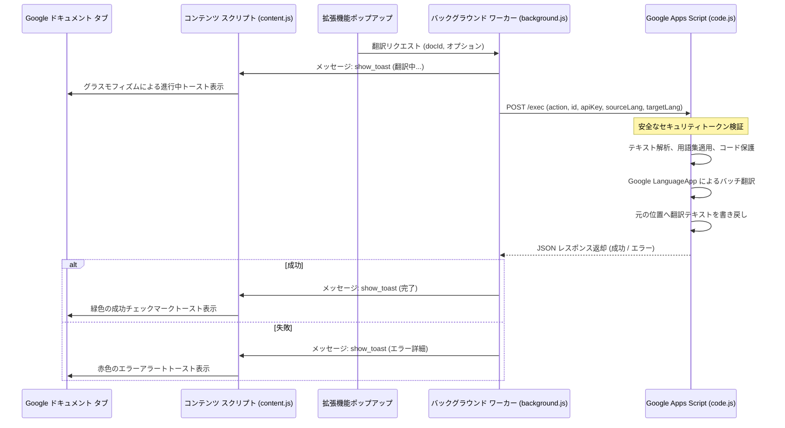

# JA-VI Sheets & Docs Translator (日本語版)

Google Chrome 拡張機能と Google Apps Script (GAS) を組み合わせ、Google スプレッドシート、ドキュメント、スライドを日本語とベトナム語の間で相互にインプレース（元の位置のまま）翻訳するオープンソースツール。コード変数や camelCase などの技術キーワードの保護、カスタム用語集（グロッサリー）機能、および洗練されたグラスモフィズムの通知トーストを備えている。

---

## 他の言語ドキュメント / Other Languages
* [English Version (Main README)](README.md)
* [Tiếng Việt (Vietnamese Version)](README_vi.md)

---

## 概要

従来のブラウザ拡張機能で Google Workspace ドキュメント（スプレッドシート、ドキュメント、スライド）を翻訳する場合、Google の複雑な HTML Canvas レンダリング（特にスプレッドシート）や複雑な DOM 構造のため、動作が遅く、失敗しやすいという課題があった。

**JA-VI Sheets & Docs Translator** は、以下のハイブリッドアーキテクチャによりこの問題を解決する。
1. **Chrome 拡張機能（フロントエンド）:** アクティブなドキュメント ID と設定を検出し、翻訳コマンドを送信する。
2. **Google Apps Script（バックエンド）:** ユーザー自身の Google アカウント内で安全に動作し、Google 公式 API を使用して、インプレース（元の位置のまま）で高速かつ安定した書き換えを実行する。

  

---

## 開発の背景・動機 (Why this project?)

日本・ベトナム間のオフショア開発をはじめとするグローバルなソフトウェア開発において、ブリッジシステムエンジニア（BrSE）やプロジェクトマネージャー（PjM）が直面する最大のボトルネックの一つが「コミュニケーションと仕様書の翻訳」である。API 設計書、データベース定義書、要件定義書などの多くは Google スプレッドシートやドキュメント、スライドで管理されている。

しかし、これらの技術文章を Google 翻訳や DeepL に手動でコピー＆ペーストして翻訳し、元のファイルに書き戻す作業は非常に手間がかかり、フォーマットの崩れやプルダウンの破損、コード変数名の誤訳などを招きやすいという問題があった。

本ツールは、この**コミュニケーションのギャップを瞬時に埋める**ために開発された。
- **BrSE & PjM 向け:** 手動の翻訳作業にかかる時間を削減し、ワンクリックで要件定義や仕様書ファイルをその場で一括翻訳が可能。
- **デベロッパー向け:** コードの変数名やキャメルケース、スネークケース、ケバブケース、数値などの技術キーワードの形式を壊すことなく、日本語とベトナム語に翻訳された仕様書へ即座にアクセス可能。仕様の誤解を防ぎ、開発の正確性を向上させる。

---

## 主な機能

- **双方向翻訳:** 日本語からベトナム語（`JA ➔ VI`）およびベトナム語から日本語（`VI ➔ JA`）の翻訳を簡単に切り替え可能。
- **所有権の自動判定＆ワンクリックコピー:** ドキュメント（Doc、Sheet、Slide）の所有者がログイン中のアカウントでない場合を自動検出し、ポップアップおよびページ上のフローティングバナーに「マイドライブにコピーを作成」ボタンを表示。
- **Google スプレッドシート翻訳オプション:** アクティブなシートのみ、またはワークブック内のすべてのシートを一括翻訳可能。
- **データの入力規則（プルダウン）の更新:** 「リストから選択」ルール内の選択肢テキストも自動的に翻訳して更新するため、フォームが翻訳後も正常に動作する。
- **技術キーワード保護機能:** コード内の変数、camelCase、PascalCase、kebab-case、snake_case、数値などを自動的に検出し、翻訳エンジンによる意図しない誤訳や破損から保護する。
- **カスタム用語集（グロッサリー）対応:** ポップアップ画面からその場でカスタムの翻訳ルールを指定可能（例: `ひたち = HITACHI`）。
- **洗練されたグラスモフィズム通知:** Google ドキュメントの画面上にオーバーレイ表示される洗練された進行状況通知トーストにより、作業を中断せずに進捗状況を確認可能。
- **100% 無料かつ安全:** サードパーティの外部サーバーを介さず、ユーザー自身の Google アカウントの無料の翻訳枠（LanguageApp）で動作するため、データ流出の懸念がない。

---

## セットアップ手順

### ステップ 1: Google Apps Script (GAS) のデプロイ
1. [Google Apps Script ダッシュボード](https://script.google.com/) にアクセスし、**「新しいプロジェクト」**を作成する。
2. [apps-script/code.js](apps-script/code.js) のコードをすべてコピーし、エディタに貼り付けて上書き保存する。
3. プロジェクト名（例: `JA-VI Translator Backend`）を付けて保存する。
4. **スクリプトの認証（強く推奨）:** 
   - ツールバーの関数リストから `authorizeScript` を選択する。
   - **「実行」**をクリックする。
   - Google の承認要求ポップアップが表示されるので、画面の指示に従ってアクセスを承認する（「詳細を表示」 ➔ 「[プロジェクト名] (安全ではないページ) に移動」をクリックして進む）。
5. **ウェブアプリとしてデプロイ:**
   - **「デプロイ ➔ 新しいデプロイ」**をクリックする。
   - 種類の選択（歯車アイコン）から**「ウェブアプリ」**を選択する。
   - **次のユーザーとして実行:** **「自分」**を選択する。
   - **アクセスできるユーザー:** **「全員」**を選択する（拡張機能からアクセスできるようにするため。アクセスはセキュリティトークンで保護される）。
   - **「デプロイ」**をクリックする。
   - 生成された**「ウェブアプリの URL」**（末尾が `/exec` のもの）をコピーする。

### ステップ 2: Chrome 拡張機能のインストール
1. このリポジトリをご自身のローカルPCにダウンロードまたはクローンする。
2. Google Chrome を開き、`chrome://extensions/` にアクセスする。
3. 右上の**「デベロッパー モード」**をオンにする。
4. 左上の**「パッケージ化されていない拡張機能を読み込む」**をクリックする。
5. このリポジトリのルートフォルダ（[manifest.json](manifest.json) が含まれるディレクトリ）を選択して読み込む。

### ステップ 3: 接続設定
1. Chrome ツールバーの **JA-VI Sheets & Docs Translator** 拡張機能アイコンをクリックしてポップアップを開く。
2. **「Settings」**タブに切り替える。
3. ステップ 1 でコピーした **Apps Script ウェブアプリの URL** を貼り付ける。
4. 任意の**セキュリティトークン (Security Token / API Key)** を入力する（任意の安全なパスフレーズ）。
5. （任意）特定の単語の翻訳を指定したい場合は、**Custom Glossary** に `元の単語 = 翻訳後の単語` の形式で1行ずつ入力する（例: `ひたち = HITACHI`）。
6. **「Save Settings」** をクリックして設定を保存する。
7. **「Verify Connection」** をクリックする。
   - *注意: 初回の接続テスト時に、指定したトークンが Apps Script のプロパティサービスに保存され、それ以降はトークンが一致するリクエストのみ実行可能となる。*

---

## 使い方
1. 日本語またはベトナム語が含まれる Google スプレッドシート、ドキュメント、またはスライドを開く。
2. 拡張機能アイコンをクリックしてポップアップを開く。
3. 翻訳方向（例: `Japanese (JA)` から `Vietnamese (VI)`）を選択する。
4. (スプレッドシートの場合) アクティブシートのみ（**Active Sheet Only**）またはすべてのシート（**All Sheets**）を選択する。
5. **「Translate Document」**ボタンをクリックする。
6. Google ドキュメントの右下にグラスモフィズム通知が表示され、翻訳処理が開始される。

---

## セキュリティとプライバシー

- **外部トラッキングなし:** テキストの解析と翻訳はすべて、Google の公式翻訳サービスおよびユーザー自身の Google アカウント内で直接処理される。外部サーバーにデータが送信されることはない。
- **エンドポイントの保護:** 設定したセキュリティトークンは、拡張機能と GAS ウェブアプリ間の認証キーとして機能します。トークンが一致しない場合、ウェブアプリ側ですべてのリクエストが拒否される。

---

## ライセンス

このプロジェクトは **MIT ライセンス** のもとでオープンソースとして配布されている。商用・非商用問わず、自由にご利用・変更・再配布が可能。
