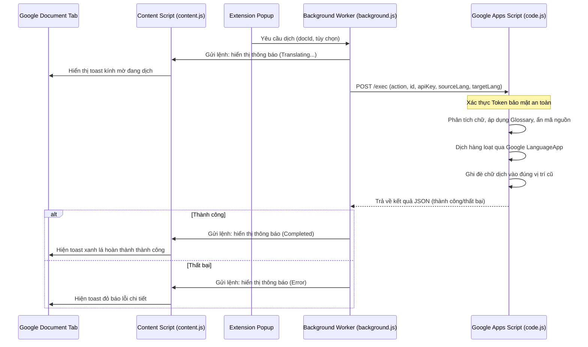

# JA-VI Sheets & Docs Translator (Tiếng Việt)

Dự án mã nguồn mở bao gồm Tiện ích mở rộng Google Chrome và đoạn mã Google Apps Script đi kèm giúp dịch tự động, ghi đè trực tiếp tài liệu Google Sheets, Google Docs, và Google Slides giữa hai ngôn ngữ tiếng Nhật và tiếng Việt. Công cụ hỗ trợ bảo vệ từ khóa kỹ thuật thông minh, từ điển dịch đè (glossary) và hệ thống thông báo trạng thái mờ (glassmorphic toasts) đẹp mắt.

---

## Các tài liệu ngôn ngữ khác / Other Languages
* [English Version (Main README)](README.md)
* [日本語版 (Japanese Version)](README_ja.md)

---

## Tổng Quan

Việc dịch các tài liệu trên Google Workspace (Sheets, Docs, Slides) bằng các tiện ích mở rộng thông thường rất chậm và dễ lỗi do cấu trúc DOM phức tạp và cơ chế dựng hình Canvas (đặc biệt là Google Sheets).

**JA-VI Sheets & Docs Translator** giải quyết vấn đề này bằng mô hình kết hợp:
1. **Chrome Extension (Mặt trước):** Nhận diện ID tài liệu đang mở, cho phép cấu hình và gửi lệnh dịch.
2. **Google Apps Script (Mặt sau/Backend):** Chạy an toàn trực tiếp trên tài khoản Google của bạn, sử dụng các hàm API chính thức của Google để dịch và ghi đè nội dung tại chỗ với tốc độ cực nhanh và tính ổn định cao.

---

## Lý Do Ra Đời Dự Án & Động Lực Phát Triển

Là một Kỹ sư Cầu nối (BrSE) và Quản trị Dự án (PjM) làm việc trong lĩnh vực phát triển phần mềm xuyên biên giới (đặc biệt là thị trường Nhật - Việt), rào cản ngôn ngữ và tài liệu kỹ thuật là một trong những điểm nghẽn lớn nhất làm giảm hiệu suất công việc. Các tài liệu đặc tả (specs), thiết kế chi tiết, tài liệu API, hay sơ đồ cơ sở dữ liệu thường được lưu trữ trên Google Sheets, Google Docs và Google Slides.

Việc sao chép thủ công từng ô hoặc đoạn văn sang Google Translate hay DeepL để dịch rồi dán ngược lại rất tốn thời gian, dễ làm hỏng cấu trúc tệp, lỗi định dạng, và phá hỏng các biến mã nguồn.

Dự án này ra đời nhằm **giải quyết triệt để vấn đề trên**:
- **Đối với BrSE & PjM:** Tiết kiệm hàng giờ dịch tài liệu thủ công, cập nhật toàn bộ file yêu cầu kỹ thuật trực tiếp tại chỗ (in-place) chỉ với một click.
- **Đối với Developer:** Tiếp cận tài liệu đặc tả tiếng Việt/tiếng Nhật đã dịch ngay lập tức mà vẫn giữ nguyên định dạng của từ khóa kỹ thuật (biến số, camelCase, snake_case, kebab-case...), từ đó hiểu đúng yêu cầu và lập trình chính xác hơn, giảm thiểu sai sót do giao tiếp.

---

## Tính Năng Nổi Bật

- **Dịch Hai Chiều:** Dễ dàng chuyển đổi linh hoạt giữa tiếng Nhật sang tiếng Việt (`JA ➔ VI`) và tiếng Việt sang tiếng Nhật (`VI ➔ JA`).
- **Tùy Chọn Google Sheets:** Dịch riêng trang tính hiện tại (Active Sheet) hoặc dịch toàn bộ các trang tính trong file.
- **Cập nhật Dropdown:** Tự động dịch các vùng dữ liệu kiểm tra (Data Validation / Dropdown) để biểu mẫu của bạn tiếp tục hoạt động bình thường.
- **Bảo Vệ Từ Khóa Kỹ Thuật:** Tự động phát hiện và bảo vệ các biến mã nguồn, từ khóa dạng camelCase, PascalCase, kebab-case, snake_case, chữ số... tránh bị dịch sai lệch hoặc làm hỏng mã code.
- **Hỗ Trợ Từ Điển Riêng (Glossary):** Cho phép tự định nghĩa từ dịch đè (Ví dụ: `ひたち = HITACHI`) trực tiếp từ popup cấu hình.
- **Thông Báo Glassmorphism Cao Cấp:** Thanh trạng thái dịch hiển thị mượt mà trực tiếp trên trang tài liệu Google, giúp bạn dễ dàng theo dõi tiến độ mà không làm gián đoạn công việc.
- **Miễn Phí & Bảo Mật 100%:** Hoạt động hoàn toàn bằng tài khoản Google cá nhân của bạn, không gửi dữ liệu qua bất kỳ máy chủ bên thứ ba nào.

---

## Hướng Dẫn Cài Đặt & Cấu Hình

### Bước 1: Triển khai Google Apps Script
1. Truy cập trang quản lý [Google Apps Script Dashboard](https://script.google.com/) và nhấn **Dự án mới** (New Project).
2. Sao chép toàn bộ mã nguồn tại [apps-script/code.js](apps-script/code.js) và dán vào trình soạn thảo (thay thế tất cả mã mặc định).
3. Lưu dự án lại (ví dụ đặt tên là `JA-VI Sheets & Docs Translator Backend`).
4. **Cấp quyền chạy Script (Khuyên Dùng):**
   - Trên thanh công cụ, chọn hàm `authorizeScript`.
   - Nhấn **Chạy** (Run).
   - Google sẽ hiển thị bảng yêu cầu cấp quyền. Hãy cấp quyền truy cập tài liệu cho script (nhấp chọn *Advanced* -> *Go to [Tên dự án] (unsafe)* để xác nhận).
5. **Triển khai dưới dạng Web App:**
   - Chọn **Triển khai ➔ Triển khai mới** (Deploy ➔ New deployment).
   - Nhấp vào biểu tượng bánh răng (Chọn loại cấu hình) và chọn **Ứng dụng web** (Web app).
   - Phần **Thực thi dưới dạng** (Execute as), chọn **Tôi (email-cua-ban@gmail.com)**.
   - Phần **Ai có quyền truy cập** (Who has access), chọn **Bất kỳ ai** (Anyone) (Bắt buộc để Extension có thể gọi API, bảo mật sẽ do Token tự chọn của bạn đảm nhiệm).
   - Nhấn **Triển khai** (Deploy).
   - Sao chép đường dẫn **URL của ứng dụng web** (có đuôi `/exec`).

### Bước 2: Cài đặt Extension trên Chrome
1. Tải hoặc clone thư mục dự án này về máy tính của bạn.
2. Mở trình duyệt Google Chrome và truy cập đường dẫn `chrome://extensions/`.
3. Bật **Chế độ dành cho nhà phát triển** (Developer mode) ở góc trên bên phải.
4. Chọn **Tải thư mục đã giải nén** (Load unpacked) ở góc trên bên trái.
5. Tìm và chọn thư mục gốc của dự án này (thư mục chứa tệp [manifest.json](manifest.json)).

### Bước 3: Cấu hình Tiện Ích
1. Click vào biểu tượng tiện ích **JA-VI Sheets & Docs Translator** trên thanh công cụ Chrome.
2. Chuyển sang tab **Settings**.
3. Dán **URL của ứng dụng web** Google Apps Script đã copy ở Bước 1 vào ô tương ứng.
4. Nhập một **Security Token (API Key)** tự chọn (Mật mã bảo mật do bạn tự nghĩ ra).
5. (Tùy chọn) Điền từ điển dịch đè tại phần **Custom Glossary** theo định dạng: `Từ_gốc = Từ_dịch` (mỗi dòng một cặp từ, ví dụ: `ひたち = HITACHI`).
6. Nhấn **Save Settings**.
7. Nhấn **Verify Connection**.
   - *Lưu ý: Trong lần kết nối đầu tiên, Token bảo mật này sẽ được đăng ký vào Apps Script của bạn. Các yêu cầu dịch sau đó chỉ thành công khi khớp chính xác Token này.*

---

## Hướng Dẫn Sử Dụng
1. Mở bất kỳ tệp Google Sheets, Google Docs hoặc Google Slides nào có nội dung tiếng Nhật hoặc tiếng Việt cần dịch.
2. Click vào biểu tượng Extension để mở bảng điều khiển.
3. Chọn hướng dịch phù hợp (Ví dụ: `Japanese (JA)` sang `Vietnamese (VI)`).
4. (Đối với Google Sheets) Chọn dịch riêng **Active Sheet Only** hoặc toàn bộ các Sheet (**All Sheets**).
5. Nhấn **Translate Document**.
6. Một thông báo trạng thái dạng kính mờ (glassmorphism) sẽ hiện lên ở góc dưới bên phải màn hình để báo hiệu quá trình dịch đang diễn ra cho đến khi hoàn tất.

---

## Bảo Mật & Riêng Tư

- **Không Theo Dõi Bên Thứ Ba:** Tất cả các hoạt động xử lý văn bản và dịch thuật đều diễn ra trực tiếp trong trình duyệt và tài khoản Google của bạn thông qua dịch vụ dịch chính thức của Google. Không có dữ liệu nào được chuyển đến các máy chủ bên ngoài.
- **Bảo Vệ Đường Truyền:** Token bảo mật hoạt động như một mật mã xác thực giữa Chrome Extension và Google Apps Script Web App của bạn. Nếu không khớp token, Web App sẽ tự động từ chối mọi yêu cầu điều khiển.

---

## Giấy Phép (License)

Dự án được phân phối dưới giấy phép **MIT License**. Bạn hoàn toàn có thể sử dụng, sửa đổi và phân phối lại cho mục đích cá nhân hoặc thương mại.
